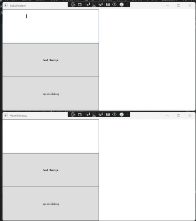

# wpfで複数のwindowを利用
## 起動時に複数のwindowを表示
WPFの起動時に複数の画面を表示する [[1]](#参考)を参考に複数window起動するようにしました。あまりにもそのままなのでコードは参考先を参照してください。<br>
作成時のPRは[こちら](https://github.com/sbkinoko/ImageTest/pull/3)です。

動作はこうなりました。<br>
同じデータを参照するようにしてないのでそれぞれで画像を選択します<br>
閉じる処理を共通化してないのでそれぞれのwindowを閉じる必要があります<br>


## データの共通化
本当は2つのウインドウを同時に閉じるっていうのをやりたかったんですが、[prism](https://github.com/PrismLibrary/Prism)というライブラリを使ったものしか見つけられなったので断念しました。<br>
そんなわけで、しょうがないのでとりあえず２つのwindowに共通のデータを入れようと思ったので`viewModel`を使ってみます。同時に閉じるのはもう少し調べます。<br>
[この辺のサイト](#参考)[2][3]を参考にしました。
画像を開くロジックを移動させるより、1から作ったほうが差分が小さそうなのでロジックを新規作成しました。<br>
以下のクラスを実装しました。<br>

TestCommand.cs
```
namespace ImageTest
{
    public class TestCommand : ICommand
    {
        private AppViewModel viewModel { get; set; }

        public TestCommand(AppViewModel viewModel)
        {
            this.viewModel = viewModel;
        }

        public event EventHandler? CanExecuteChanged
        {
            add
            {
                CommandManager.RequerySuggested += value;
            }
            remove
            {
                CommandManager.RequerySuggested -= value;
            }
        }

        public bool CanExecute(object? parameter)
        {
            return true;
        }

        public void Execute(object? parameter)
        {
            viewModel.Value += "a";
        }
    }
}
```
buttonにbindingするためにICommandを継承させます。詳しくは参考サイトを見てください、丸投げします。[この辺](https://resanaplaza.com/2020/07/27/%E4%B8%96%E7%95%8C%E3%81%A7%E4%B8%80%E7%95%AA%E7%9F%AD%E3%81%84%E3%82%B5%E3%83%B3%E3%83%97%E3%83%AB%E3%81%A7%E8%A6%9A%E3%81%88%E3%82%8Bmvvm%E5%85%A5%E9%96%80/#index_id8)です。
上記のクラスがやることは文字列を長くすることです。

AppViewModel.cs
```
namespace ImageTest
{
    public class AppViewModel : INotifyPropertyChanged
    {
        public event PropertyChangedEventHandler? PropertyChanged;

        private string test = "";

        public TestCommand TestCommand { get; set; }

        public AppViewModel()
        {
            TestCommand = new TestCommand(this);
        }

        public string Value
        {
            get
            {
                return test;
            }

            set
            {
                test = value;
                if (PropertyChanged != null)
                {
                    PropertyChanged(
                        this,
                        new PropertyChangedEventArgs("Value")
                    );
                }
            }
        }
    }
}
```
Valueが変更されたことをviewに通知することでviewが最新の情報を参照できるようになります。


レイアウトもちょい修正

MainWIndow.xml(SubWindowも同じ変更を)
```
    <Grid>
        <Grid.ColumnDefinitions>
            <ColumnDefinition/>
            <ColumnDefinition/>
        </Grid.ColumnDefinitions>
        <Grid>
            <Grid.RowDefinitions>
                <RowDefinition/>
                <RowDefinition/>
                <RowDefinition/>
            </Grid.RowDefinitions>
            <TextBox
                Grid.Row="0"
                Text="{Binding Value, Mode=TwoWay, UpdateSourceTrigger=PropertyChanged}"
                />
            <Button
                Grid.Row="1"
                Command="{Binding TestCommand}"
                >
                text change
            </Button>
            <Button
                Click="Button_Click"
                Grid.Row="2"
            >
                open dialog
            </Button>
        </Grid>

        <Image
            Grid.Column="1"
            x:Name="roadedImage"
            />
    </Grid>
```
Gridの一部を変更した感じです。<br>
テキストボックスで文章を変えてもviewModelに反映されないのは気持ち悪かったので双方向でbindingしました。参考にしたのは[こちらのサイト](#参考)[4]です。<br>
該当部だけピックしておきます。
```
            <TextBox
                Grid.Row="0"
                Text="{Binding Value, Mode=TwoWay, UpdateSourceTrigger=PropertyChanged}"
                />
```

で、viewModelを複数のwindowに紐づけます。[複数windowを表示](#参考)[1]を参考にしてwindowを複数表示するようにしたので、そのままapp.xml.csをベースにviewModelの紐づけを行います。[stackOverFLowの回答](#参考)を参考にxmlで設定したかったんですが、うまくいかず……。<br>
結局巡り巡って[\[2\]](#参考)([のこの辺](https://resanaplaza.com/2020/07/27/%e4%b8%96%e7%95%8c%e3%81%a7%e4%b8%80%e7%95%aa%e7%9f%ad%e3%81%84%e3%82%b5%e3%83%b3%e3%83%97%e3%83%ab%e3%81%a7%e8%a6%9a%e3%81%88%e3%82%8bmvvm%e5%85%a5%e9%96%80/#index_id6:~:text=%E5%AE%9F%E9%9A%9B%E3%80%81%E3%81%84%E3%81%8F%E3%81%A4%E3%81%8B%E3%81%AE%E5%85%A5%E9%96%80%E3%82%B5%E3%82%A4%E3%83%88%E3%81%A7%E3%81%AF%E3%80%81%E3%82%B3%E3%83%B3%E3%82%B9%E3%83%88%E3%83%A9%E3%82%AF%E3%82%BF%E3%81%A7%E3%82%AF%E3%83%A9%E3%82%B9%E3%82%92%E7%94%9F%E6%88%90%E3%81%99%E3%82%8B%E3%82%B5%E3%83%B3%E3%83%97%E3%83%AB%E3%81%8C%E6%8E%B2%E8%BC%89%E3%81%95%E3%82%8C%E3%81%A6%E3%81%84%E3%81%BE%E3%81%97%E3%81%9F%E3%80%82))を参考にして、実装しました。

App.xml.cs
```
    public partial class App : Application
    {

        static MainWindow objMainWindow;
        static SubWindow objSubWindow;

        static AppViewModel objAppViewModel;

        protected override void OnStartup(StartupEventArgs e)
        {
            objAppViewModel = new AppViewModel();

            objMainWindow = new MainWindow(
                objAppViewModel
                );
            objSubWindow = new SubWindow(
                objAppViewModel
                );

            objMainWindow.Show();
            objSubWindow.Show();
        }
    }
```
実際には別のサイトも見たような気もしますが、見失ってしまいした残念……。多分stackOverFlowだったと思うんだけどな……。こまめにメモを取るなり、ブクマするなり、すぐに書くなりしないとだめですね。<br>
あと、しれっと書き足す必要があるのが、これです。

MainWindow.xaml.cs(SubWindowも)
```
        public MainWindow(AppViewModel sharedViewModel)
        {
            this.DataContext = sharedViewModel;
            InitializeComponent();
        }
```
一部抜粋です。<br>
window作成時に、applicationレベルからviewModelをinjectしてあげることにしました。
dataContextを設定できればいいので別にこれでよかったんですね。

これでアプリを動かすと以下の様になりました。
複数のwindow、viewから単一のviewModelを参照することができました。



[公式のMVVMページ](https://learn.microsoft.com/ja-jp/dotnet/architecture/maui/mvvm)[\[6\]](#参考)もあったので張っておきます。<br>
後半部分を実装したPRは[こちら](https://github.com/sbkinoko/ImageTest/pull/5/files)です。記事全体のPRは[こちら](https://github.com/sbkinoko/ImageTest/pull/4/files)です。


## 参考
[1][WPFの起動時に複数の画面を表示する](https://todosoft.net/blog/?p=279)

[2][世界で一番短いサンプルで覚えるMVVM入門](https://resanaplaza.com/2020/07/27/%e4%b8%96%e7%95%8c%e3%81%a7%e4%b8%80%e7%95%aa%e7%9f%ad%e3%81%84%e3%82%b5%e3%83%b3%e3%83%97%e3%83%ab%e3%81%a7%e8%a6%9a%e3%81%88%e3%82%8bmvvm%e5%85%a5%e9%96%80/)

[3][【C#】WPFでMVVMをフレームワークなしでシンプルに構築する](https://zenn.dev/takuty/articles/b12f4011871058)

[4][【WPF覚書】双方向データバインディング](https://qiita.com/TAK_EMI/items/d7991a34f815d9d73e32)

[5][How to have multiple Views using the same ViewModel in MVVM?](https://stackoverflow.com/questions/51537011/how-to-have-multiple-views-using-the-same-viewmodel-in-mvvm)

[6][Model-View-ViewModel (MVVM)](https://learn.microsoft.com/ja-jp/dotnet/architecture/maui/mvvm)