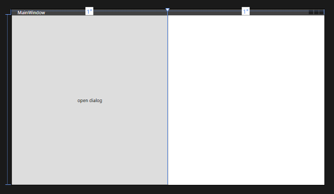
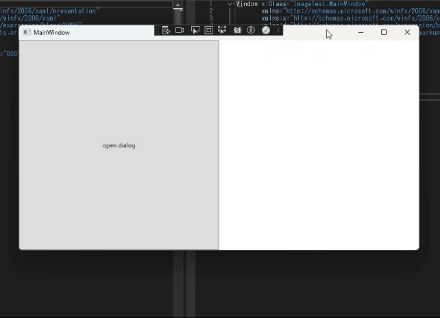

# ダイアログを利用して画像を選択して開く方法
## 内容
wpfを利用して、選択した画像ファイルを表示するアプリを作成します
作成物のrepositoryは[こちら](https://github.com/sbkinoko/ImageTest)です
## レイアウトを作る
button・imageを配置します[\[1\]](#参考)

MainWindow.xaml
```
<Window x:Class="ImageTest.MainWindow"
        xmlns="http://schemas.microsoft.com/winfx/2006/xaml/presentation"
        xmlns:x="http://schemas.microsoft.com/winfx/2006/xaml"
        xmlns:d="http://schemas.microsoft.com/expression/blend/2008"
        xmlns:mc="http://schemas.openxmlformats.org/markup-compatibility/2006"
        xmlns:local="clr-namespace:ImageTest"
        mc:Ignorable="d"
        Title="MainWindow" Height="450" Width="800">
    <Grid>
        <Grid.ColumnDefinitions>
            <ColumnDefinition/>
            <ColumnDefinition/>
        </Grid.ColumnDefinitions>
        <Button
            Grid.Column="0"
            >
            open dialog
        </Button>
        <Image
            Grid.Column="1"
            x:Name="roadedImage"
            />
    </Grid>
</Window>

```
現状のレイアウトはこうです


## ロジック
ボタンにロジックを埋め込んでおしまいです[\[2\]](#参考)[\[3\]](#参考)[\[4\]](#参考)

MainWindow.xaml.cs に追記
```
private void Button_Click(object sender, RoutedEventArgs e)
{
    selectFile();
}

private void selectFile()
{
    //OpenFileDialog
    OpenFileDialog openFileDialog = new OpenFileDialog();
    {
        openFileDialog.Title = "ファイル選択ダイアログ";
        openFileDialog.Filter = "すべてのファイル(*.*)|*.*";

        //ファイル選択ダイアログを開く
        if (openFileDialog.ShowDialog() == true)
        {
            roadedImage.Source = new BitmapImage(new Uri(openFileDialog.FileName));
        }
    }
}
```
ダイアログを開くコード(`Result.Ok` と `using`)に関しては、動かなかったのでgptに聞いて修正しました。


また、このままだとボタンを押したときの挙動と紐づけられないので、ButtonのClickを利用して紐づけ作業を行います

```
<Button
    Click="Button_Click" 
    Grid.Column="0"
    >
    open dialog
</Button>
```

## 完成

挙動はこうです
思ってたよりすんなりできました


## 参考
\[1\] [方法: グリッド要素を作成する](https://learn.microsoft.com/ja-jp/dotnet/desktop/wpf/controls/how-to-create-a-grid-element?view=netframeworkdesktop-4.8)

\[2\] [チュートリアル: C# でシンプルな WPF アプリケーションを作成する](https://learn.microsoft.com/ja-jp/visualstudio/get-started/csharp/tutorial-wpf?view=vs-2022#add-the-button-control)

\[3\][【Tips】「ファイルを開く」ダイアログでファイルのフルパスを取得したい【OpenFileDialog】](https://qiita.com/ryojio2k/items/d6b1c39ca360373d9025)

\[4\][\[WPF\] Imageコントロールで画像を表示する](http://blog.pionet.co.jp/experience/archives/2111)