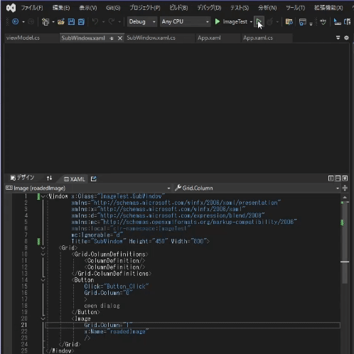

# wpfで複数のwindowを利用

## 起動時に複数のwindowを表示
WPFの起動時に複数の画面を表示する [[1]](参考)を参考に複数window起動するようにしました。あまりにもそのままなのでコードは参考先を参照してください。

動作はこうなりました。 
同じデータを参照するようにしてないのでそれぞれで画像を選択します 
閉じる処理を共通化してないのでそれぞれのwindowを閉じる必要があります 

## データの共通化

## 参考
[1] [WPFの起動時に複数の画面を表示する](https://todosoft.net/blog/?p=279)